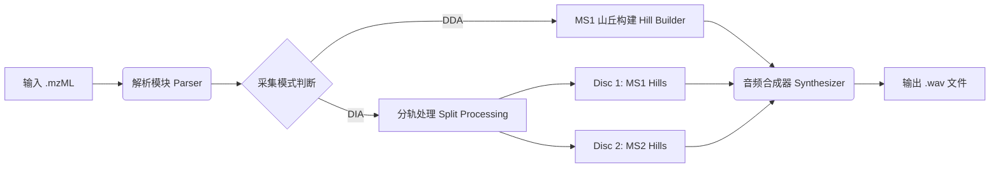

# Cicada 系统架构设计

本文档详细描述了 Cicada 的技术架构。Cicada 是一款高性能 CLI 工具，旨在将质谱数据转化为音频。设计核心在于“全保真”（保留包括噪音在内的所有信号）以及处理 GB 级大数据集的高效性。

## 1. 核心理念与约束

*   **全保真 (Full Fidelity)**：不进行特征过滤、不进行同位素合并、不进行电荷去卷积。所有追踪到的有效信号都将被渲染。
*   **高性能**：必须能够处理数百万个信号点。选择 **Rust** 作为开发语言。
*   **模块化**：解析 (Parsing)、算法 (Algorithm) 与合成 (Synthesis) 逻辑清晰分离。

## 2. 高层架构：流水线模型 (Pipeline)

Cicada 采用 **线性流水线架构**。数据经过一系列转换，从原始文件流向音频缓存。

## 3. 模块划分 (Crate Structure)

项目将采用标准的 Rust 项目结构，划分为以下子模块：

### 3.1 `src/io` (输入/输出)
*   **职责**：高效读取 mzML 文件，写入 WAV 文件。
*   **关键组件**：
    *   `MzmlReader`：
        *   封装 `quick-xml` 解析器。
        *   **设计模式**：采用 **同步状态机 (Synchronous State Machine)** 模式（参考 Sage 项目）。使用枚举 (`State`) 明确追踪 XML 解析上下文（如 Spectrum, Scan, BinaryDataArray），以确保复杂嵌套标签的解析健壮性。
        *   **IO 策略**：目前采用同步 (Synchronous/Blocking) IO。对于单文件 CLI 工具，本地磁盘读取速度通常不是瓶颈，同步模型能显著降低代码复杂度（无需引入 Tokio 运行时）。
        *   采用迭代器模式逐个读取谱图，以最小化内存占用。
    *   `WavWriter`：处理音频数据向标准 WAV 格式（16-bit/24-bit PCM）的序列化。

### 3.2 `src/core` (数据结构)
*   **职责**：定义全系统通用的基础数据类型。
*   **关键结构体**：
    *   `Peak` (点)：`{ mz: f64, intensity: f32 }` - 数据的最小单位。
    *   `Spectrum` (谱图)：`{ index: usize, time: f64, peaks: Vec<Peak>, ms_level: u8 }` - 单次扫描的集合。
    *   `Hill` (山丘/轨迹)：`{ mz_values: Vec<f64>, intensity_values: Vec<f32>, scan_indices: Vec<usize>, last_scan_index: usize, mz_guess: f64 }` - 随时间连续的信号轨迹。

### 3.3 `src/algo` (核心算法)
*   **职责**：Cicada 的“大脑”，实现信号追踪逻辑。
*   **关键组件**：
    *   `HillBuilder`：
        *   实现 **双指针贪婪匹配 (Two-Pointer Greedy Matching)** 算法（参考 Dinosaur）。
        *   维护 **活跃山丘列表 (Active Hill List)**。
        *   处理 **滚动 m/z 预测 (Rolling mzGuess)** 以消除抖动误差。
        *   **Gap Skipping (跳跃连接)**：允许轨迹跨越少量的缺失 Scan 进行连接（默认 `MaxGap = 1`，即允许中间缺失 1 帧）。
        *   **稀疏存储**：对于跳过的 Gap，**不**在算法层插入“假数据”或 0 值，而是保持数据的稀疏性 `(Time, Intensity)`，留待合成层处理。
        *   **核心准则**：仅进行连接操作。**严禁** 峰分裂（no `decompose`），**不进行** 同位素打分过滤。

### 3.4 `src/synth` (音频合成)
*   **职责**：将 `Hill` 对象转化为音频采样点，并将所有 Hill 的信号混合为最终缓存。
*   **合成原理**：每个 Hill 对应一条正弦波 `A(t) · sin(2π·f·t)`，其中频率 `f` 由 `average_mz` 线性映射（`[300, 1000] m/z → [30, 4200] Hz`），振幅包络 `A(t)` 由 PCHIP 插值得出。最终音频为所有 Hill 在每个采样点的叠加值（`+=`）。无独立 Mixer 组件——叠加直接在 `render_into_chunk` 的 `+=` 中完成。
*   **关键组件**：
    *   `PchipInterpolator` (`interpolate.rs`)：
        *   直接处理 Hill 提供的稀疏时间点。
        *   **隐式填充**：利用 PCHIP 算法处理非均匀采样的特性，自动填补缺失 Scan 处的振幅，生成平滑的包络曲线，消除断点导致的”爆音”。
        *   在 `Synthesizer::render` 中对所有 Hill **并行预构建一次**，之后在各 bucket 的渲染中直接复用，避免重复构造。
    *   `Oscillator::render_into_chunk` (`oscillator.rs`)：
        *   接受预构建的 `&PchipInterpolator` 和 `&mut [f32]` chunk slice，直接写入输出缓存，无中间 Vec 分配。
        *   **振幅线性插值**：PCHIP 每 `AMP_INTERP_STEP`（默认 64）个采样点求值一次，两次求值之间用线性插值填充，PCHIP 调用量减少约 64 倍。`AMP_INTERP_STEP` 是控制包络插值密度的唯一常量。
        *   **sin 递推**：利用 `sin(θ+Δθ) = sinθ·cosΔθ + cosθ·sinΔθ` 递推相位，每 64 个样本只需初始化一次 sin/cos，内层循环为纯乘加运算，消除逐样本 `sin()` 调用。
    *   `Synthesizer::render` (`synthesizer.rs`)：
        *   **并行预构建插值器**：在分桶前对所有 Hill 并行构建 `PchipInterpolator`，每个 Hill 仅构建一次。
        *   **时间分桶（Bucket Sort）**：将时间轴划分为 1 秒的桶，每个桶存储与之重叠的 Hill 索引列表。
        *   **并行渲染**：通过 `rayon::par_chunks_mut` 并行处理各桶，每个线程直接向自己的 chunk slice 写入，无锁无分配。
        *   最终对整体缓存做峰值归一化至 0.9。

## 4. 针对不同采集模式的策略

### 4.1 DDA 策略 (单轨模式)
*   **输入**：仅过滤 `MS Level == 1`。
*   **处理**：对 MS1 数据流运行 `HillBuilder`。
*   **输出**：单个 `.wav` 文件（呈现样品的整体“声景”）。

### 4.2 DIA 策略 (双唱片模式)
*   **输入**：读取所有级别谱图。
*   **Disc A (MS1 母离子轨)**：
    *   过滤 `MS Level == 1`，进行山丘构建。
    *   输出：`*_ms1.wav`（基础旋律层）。
*   **Disc B (MS2 碎片离子轨)**：
    *   过滤 `MS Level == 2`。
    *   **核心逻辑**：将 DIA 的 MS2 扫描视为连续的时间序列（伪 MS1）。
    *   进行山丘构建，捕捉碎片离子的同步变化。
    *   输出：`*_ms2.wav`（丰富的和弦与纹理层）。

## 5. 技术栈与依赖

*   **语言**：Rust (Edition 2021+)
*   **并行计算**：`rayon`
    *   用于合成阶段的并行渲染（数千个正弦波的渲染是“易并行”任务）。
*   **XML 解析**：`quick-xml` 或专业质谱库。
*   **音频编码**：`hound` (WAV 编码)。

## 6. 性能设计要点

| 瓶颈 | 解决方案 | 收益 |
|------|----------|------|
| PchipInterpolator 每 (Hill, bucket) 重复构建 | 并行预构建，每 Hill 仅构建一次 | 消除 O(N×T) 重复计算 |
| 每 (Hill, bucket) 分配中间 Vec | `render_into_chunk` 直写 chunk slice | 消除百万级堆分配 |
| 每样本调用 PCHIP（44100次/秒/Hill） | 振幅线性插值，每 64 样本调用一次 | PCHIP 调用减少 ~64× |
| 每样本调用 `sin()` | sin 递推关系，每块仅初始化一次 | 消除内层循环超越函数调用 |